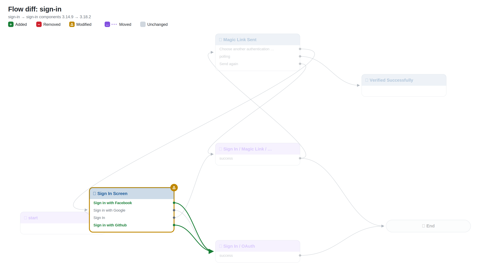
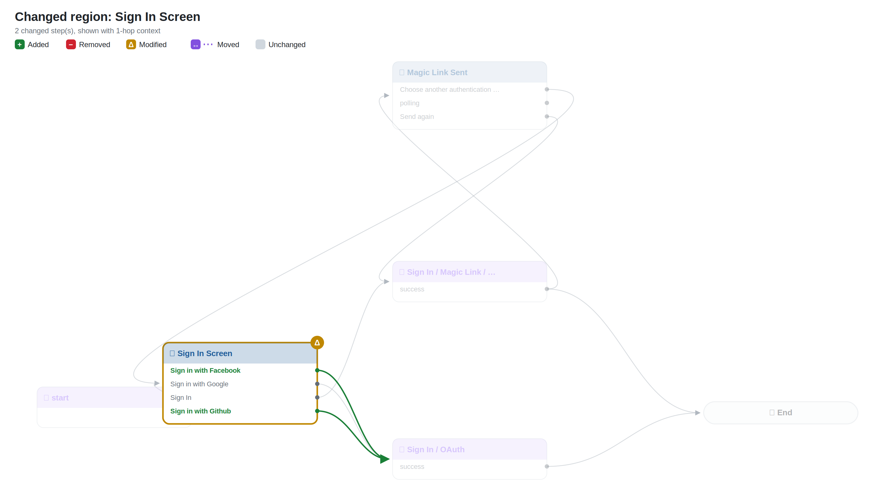
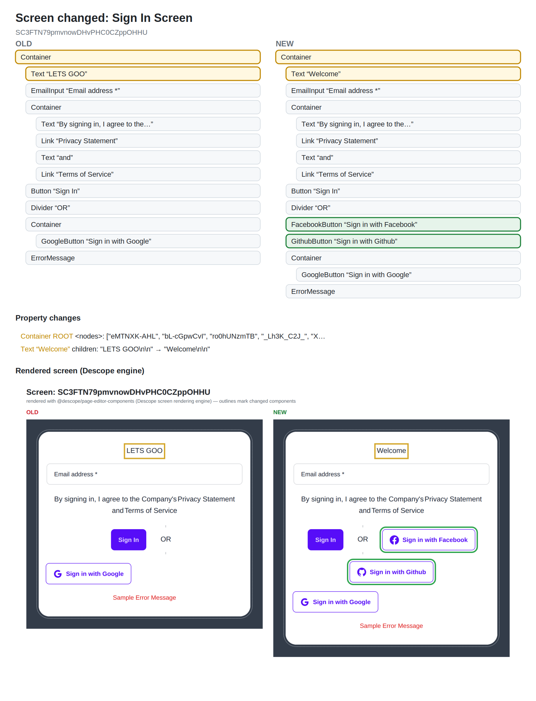

# Flow diff: `sign-in`

> Components version bump: **3.14.9 → 3.18.2** (0 default-prop changes suppressed as upgrade noise)

## Changes

- 🟡 **Modified** `0` — Sign In Screen (screen)
- 🟢 **New connection** Sign In Screen ·7GQnOKn5hG· → Sign In / OAuth
- 🟢 **New connection** Sign In Screen ·cf5EF1n0xK· → Sign In / OAuth

## Overview

## Changed regions

## Screen changes

