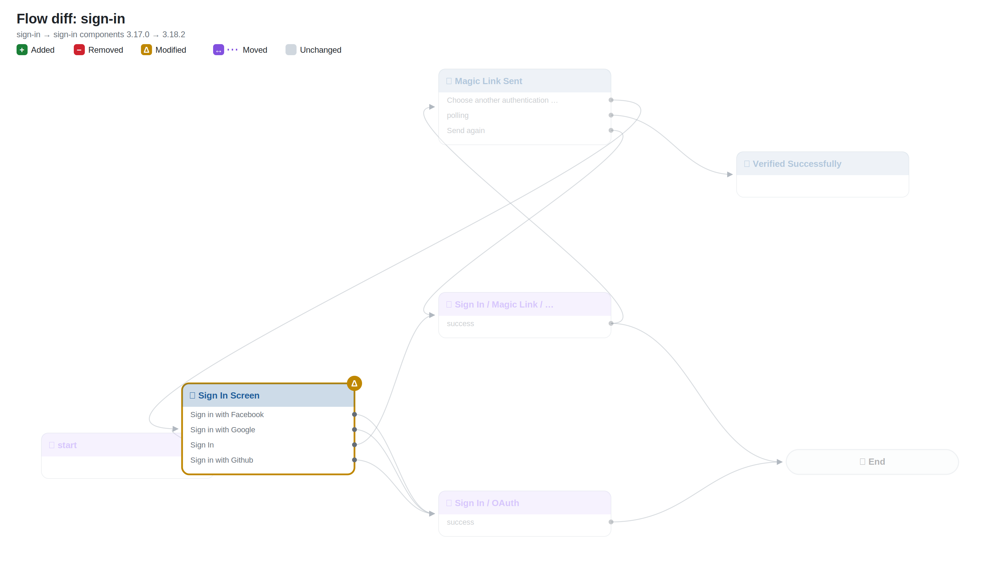
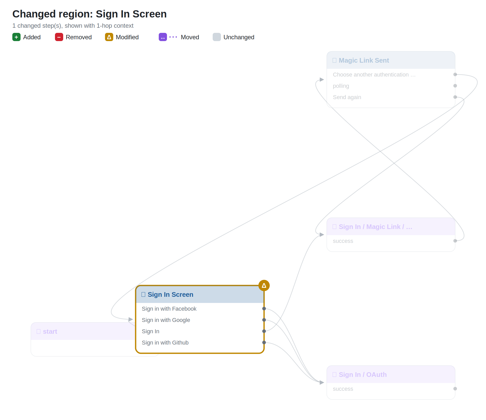
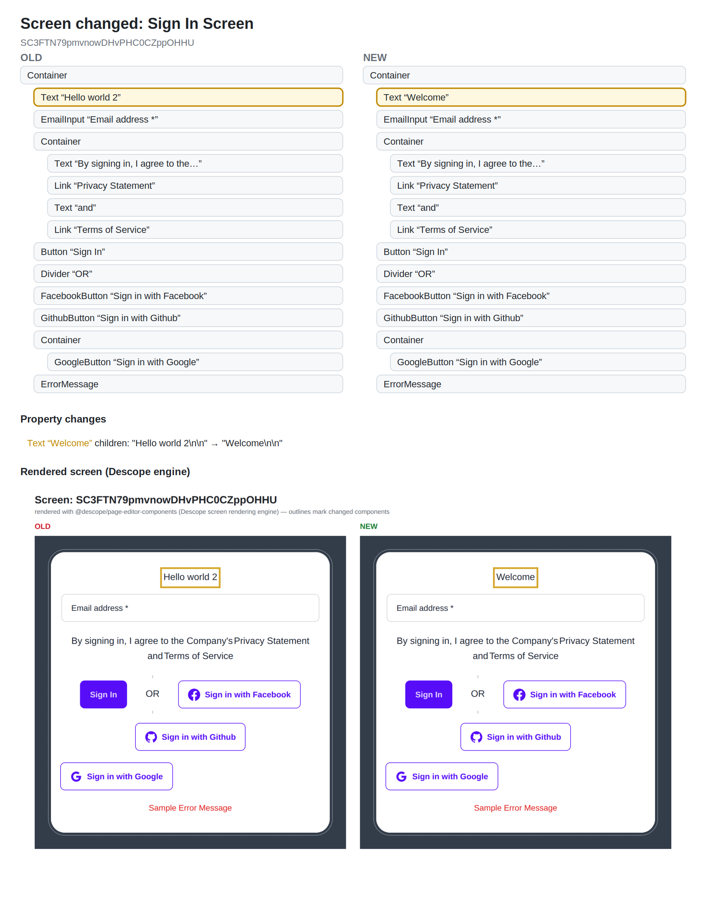

# Flow diff: `sign-in`

> Components version bump: **3.17.0 → 3.18.2** (0 default-prop changes suppressed as upgrade noise)

## Changes

- 🟡 **Modified** `0` — Sign In Screen (htmlTemplate, interactions, screen)

## Overview

## Changed regions

## Screen changes

