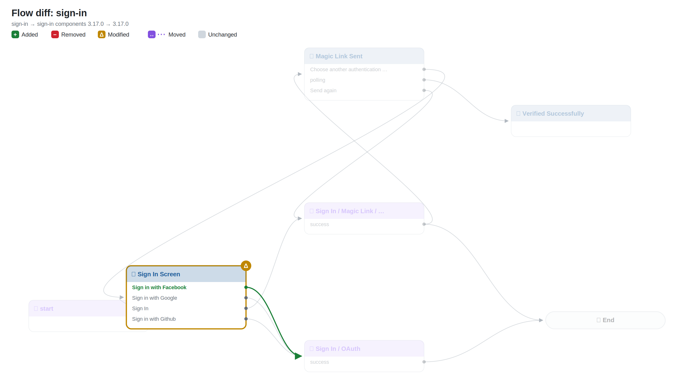
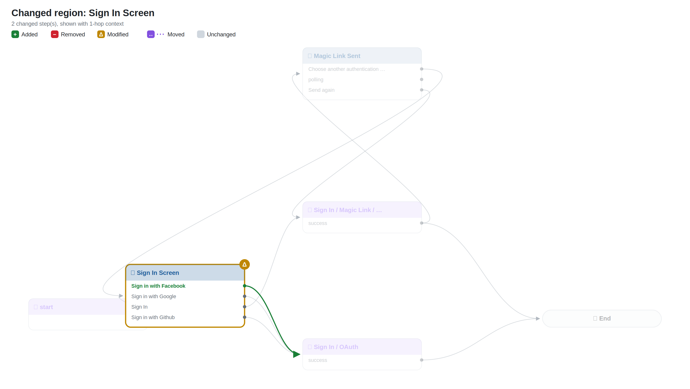
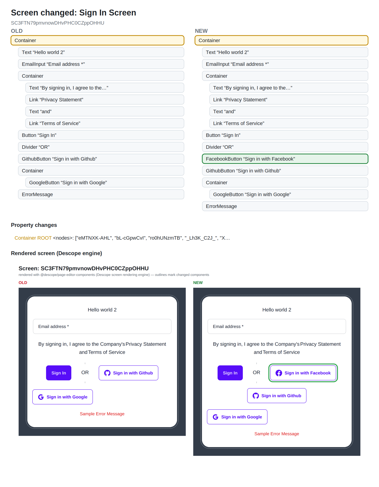

# Flow diff: `sign-in`

## Changes

- 🟡 **Modified** `0` — Sign In Screen (htmlTemplate, interactions, screen)
- 🟢 **New connection** Sign In Screen ·7GQnOKn5hG· → Sign In / OAuth

## Overview

## Changed regions

## Screen changes

