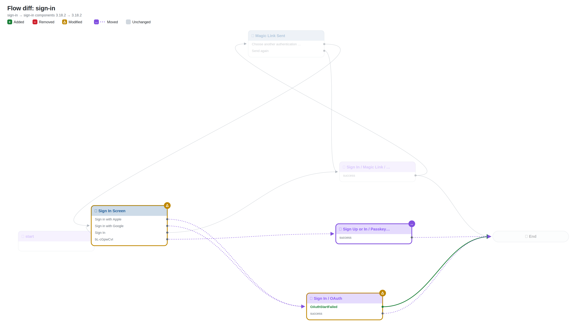
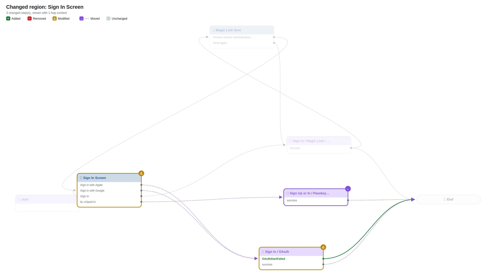
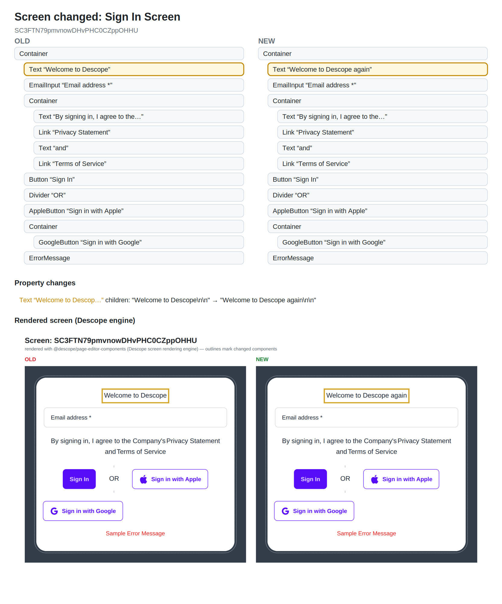
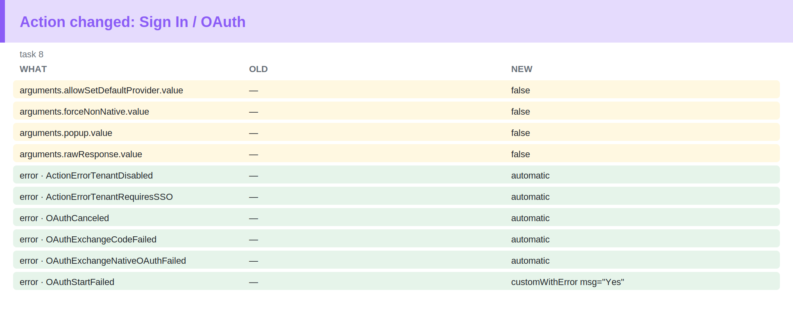

# Flow diff: `sign-in`

## Changes

- 🟡 **Modified** `0` — Sign In Screen (htmlTemplate, interactions, screen)
- 🟡 **Modified** `8` — Sign In / OAuth (arguments, errorHandlingV2)
- 🟢 **New connection** Sign In / OAuth ·OAuthStartFailed· → End
- 🟣 Moved (position only, shown on connecting lines): Sign In / OAuth, Sign Up or In / Passkeys (WebAuthn)
- 🟡 **Error handling** Sign In / OAuth · ActionErrorTenantDisabled: — → automatic
- 🟡 **Error handling** Sign In / OAuth · ActionErrorTenantRequiresSSO: — → automatic
- 🟡 **Error handling** Sign In / OAuth · OAuthCanceled: — → automatic
- 🟡 **Error handling** Sign In / OAuth · OAuthExchangeCodeFailed: — → automatic
- 🟡 **Error handling** Sign In / OAuth · OAuthExchangeNativeOAuthFailed: — → automatic
- 🟡 **Error handling** Sign In / OAuth · OAuthStartFailed: — → customWithError msg="Yes"

## Overview

## Changed regions

## Screen changes

## Action changes

