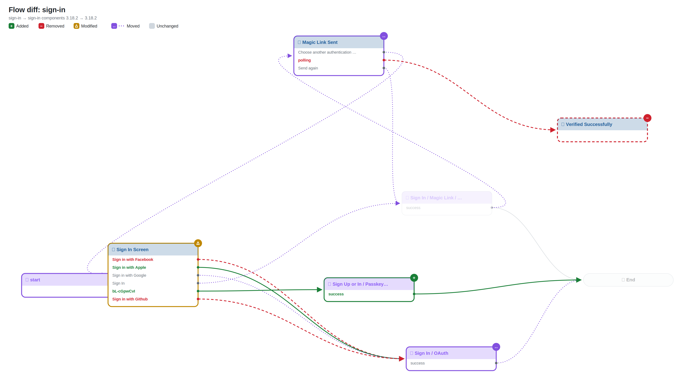
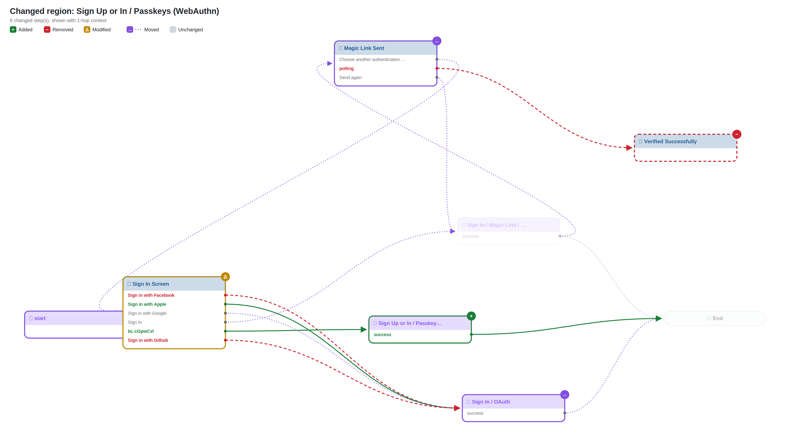
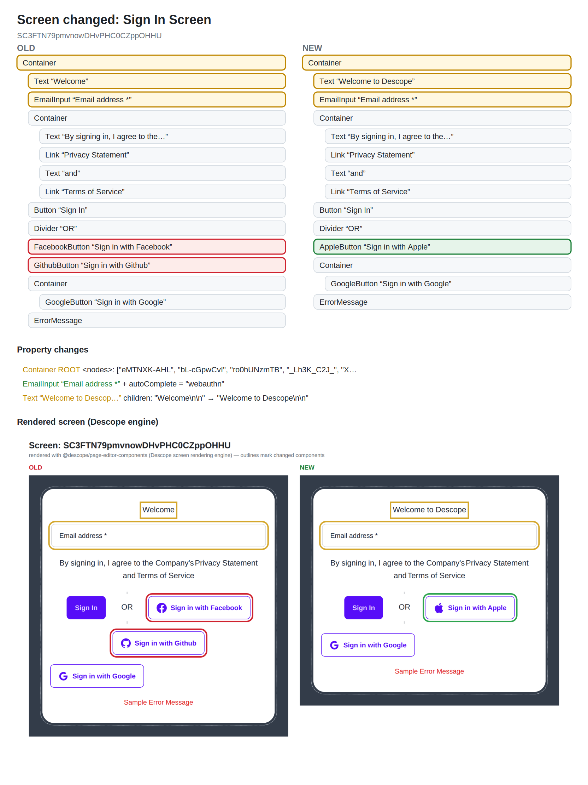
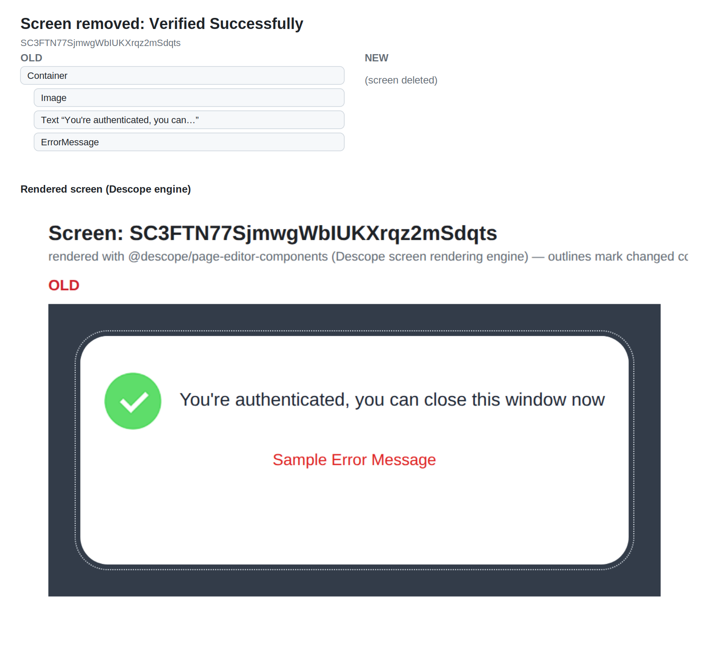

# Flow diff: `sign-in`

## Changes

- 🟢 **Added automated** `9` — Sign Up or In / Passkeys (WebAuthn)
- 🔴 **Removed screen** `7` — Verified Successfully
- 🟡 **Modified** `0` — Sign In Screen (htmlTemplate, interactions, screen)
- 🟢 **New connection** Sign In Screen ·Cf2ZQ46VfU· → Sign In / OAuth
- 🟢 **New connection** Sign In Screen ·bL-cGpwCvI· → Sign Up or In / Passkeys (WebAuthn)
- 🟢 **New connection** Sign Up or In / Passkeys (WebAuthn) ·success· → End
- 🔴 **Removed connection** Sign In Screen ·7GQnOKn5hG· → Sign In / OAuth
- 🔴 **Removed connection** Sign In Screen ·cf5EF1n0xK· → Sign In / OAuth
- 🔴 **Removed connection** Magic Link Sent ·polling· → Verified Successfully
- 🟣 Moved (position only, shown on connecting lines): Sign In Screen, Magic Link Sent, Sign In / OAuth, start

## Overview

## Changed regions

## Screen changes

