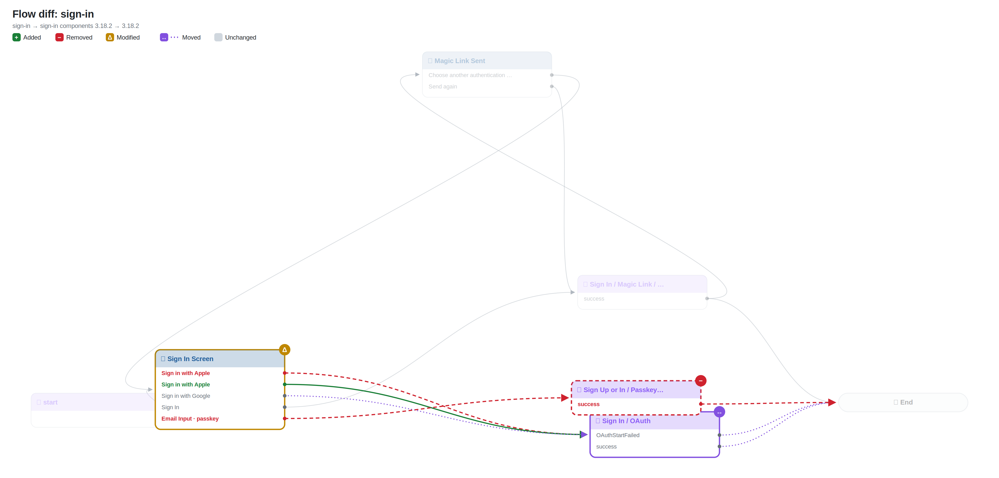
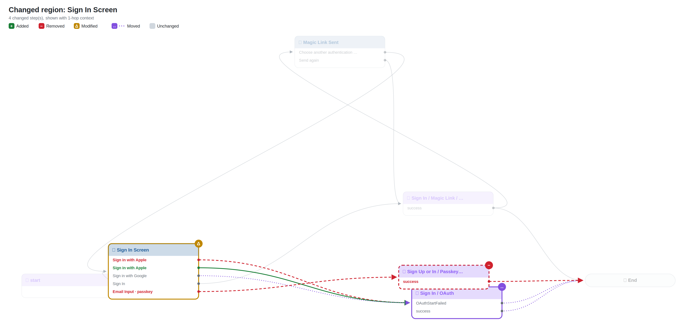
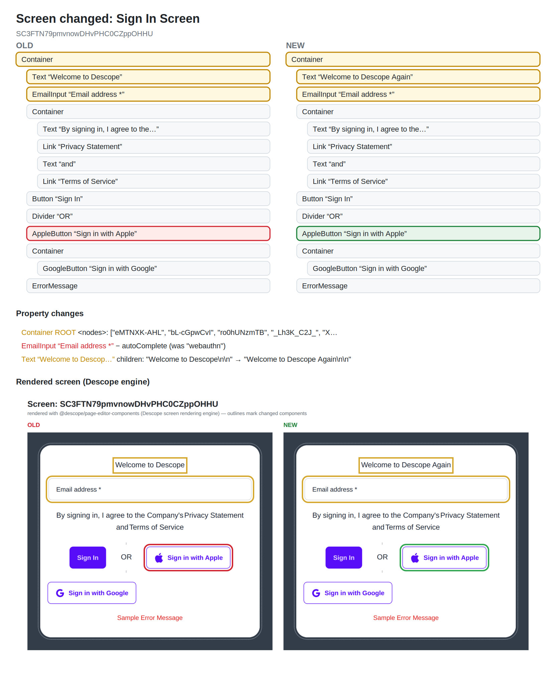

# Flow diff: `sign-in`

## Changes

- 🔴 **Removed automated** `9` — Sign Up or In / Passkeys (WebAuthn)
- 🟡 **Modified** `0` — Sign In Screen (htmlTemplate, interactions, screen)
- 🟢 **New connection** Sign In Screen ·Kl4hJnUjt-· → Sign In / OAuth
- 🔴 **Removed connection** Sign In Screen ·Cf2ZQ46VfU· → Sign In / OAuth
- 🔴 **Removed connection** Sign In Screen ·bL-cGpwCvI· → Sign Up or In / Passkeys (WebAuthn)
- 🔴 **Removed connection** Sign Up or In / Passkeys (WebAuthn) ·success· → End
- 🟣 Moved (position only, shown on connecting lines): Sign In / OAuth

## Overview

## Changed regions

## Screen changes

