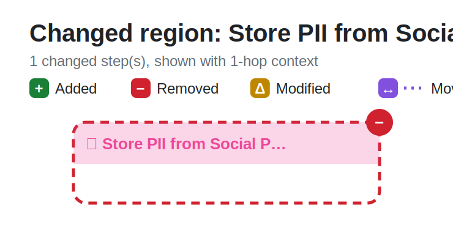
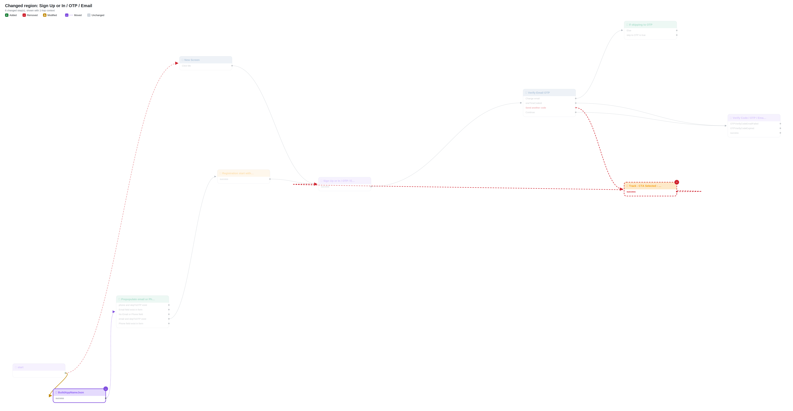
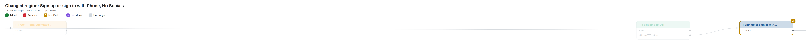
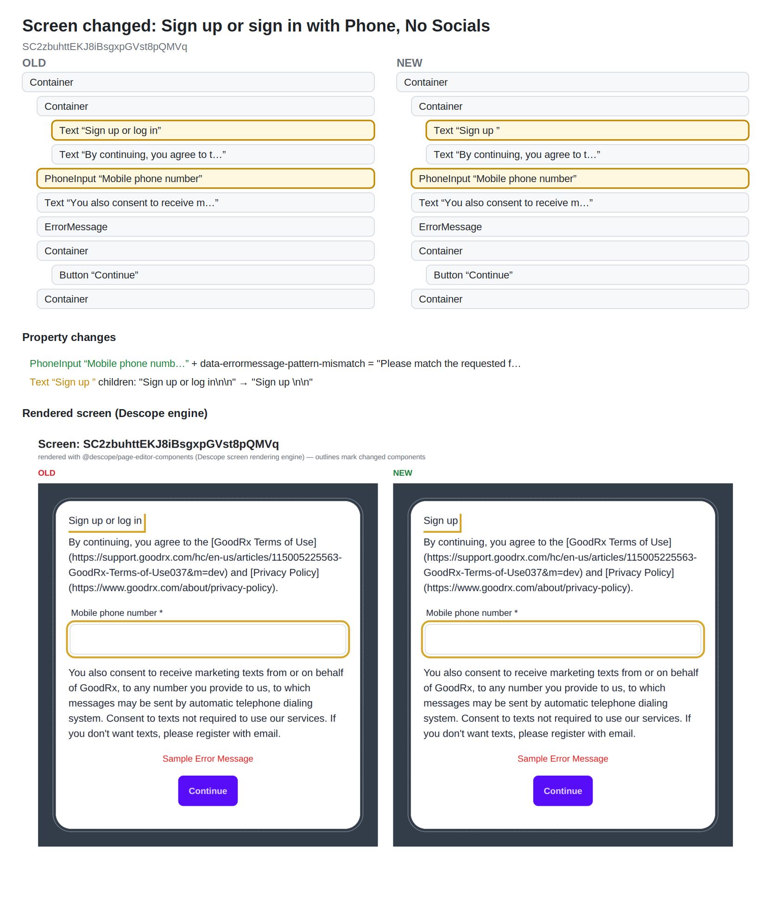

# Flow diff: `sign-up-or-in-universal-login`

## Changes

- 🔴 **Removed flow** `14` — Store PII from Social Providers
- 🔴 **Removed connector** `30` — Track - CTA Selected - Send Another Code
- 🟡 **Modified** `55` — Sign up or sign in with Phone, No Socials (clientScripts, componentsConditions, componentsConnectors, connectorComponentProps, dynamicSelects, htmlTemplate, interactions, recoveryCodesData, screen)
- 🟡 **Rewired** start ·· : New Screen → **BuildAppNameJson**
- 🔴 **Removed connection** Track - CTA Selected - Send Another Code ·success· → Sign Up or In / OTP / Email
- 🔴 **Removed connection** Verify Email OTP ·resend· → Track - CTA Selected - Send Another Code
- 🟣 Moved (position only, shown on connecting lines): End, BuildAppNameJson
- 🟡 **Error handling** Track - CTA Selected - Send Another Code · ConnectorFailed: automatic → —
- 🟡 **Error handling** Track - CTA Selected - Send Another Code · generic_error: automatic → —
- 🟡 **Error handling** Track - CTA Selected - Send Another Code · missing_field: automatic → —

## Overview

## Changed regions

## Screen changes

