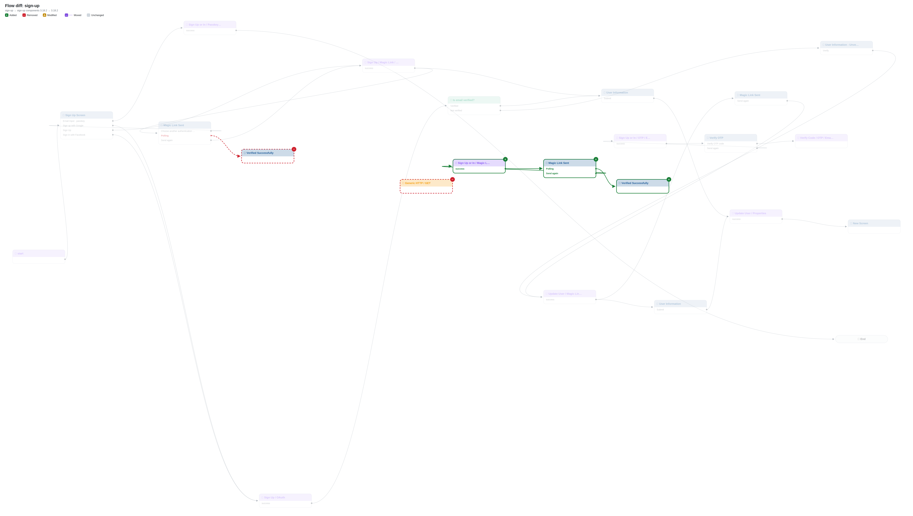
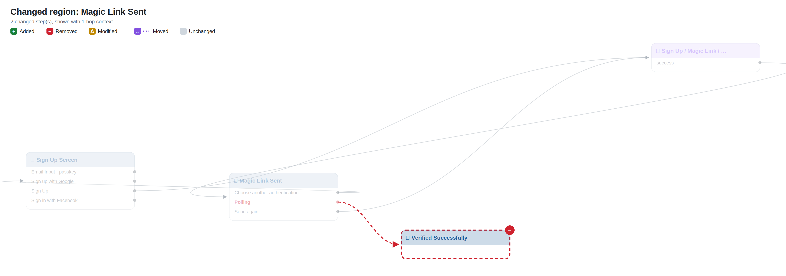
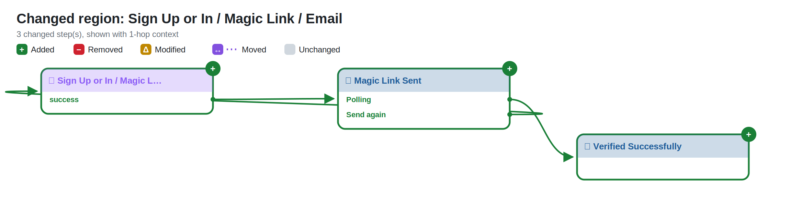
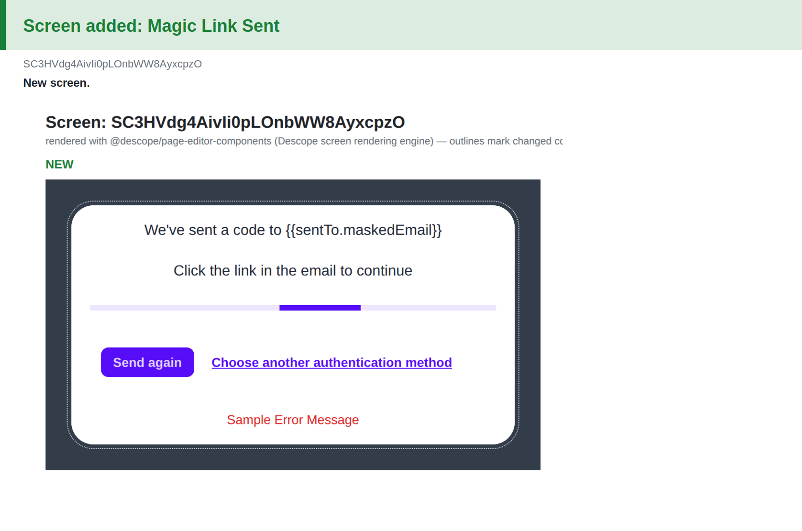
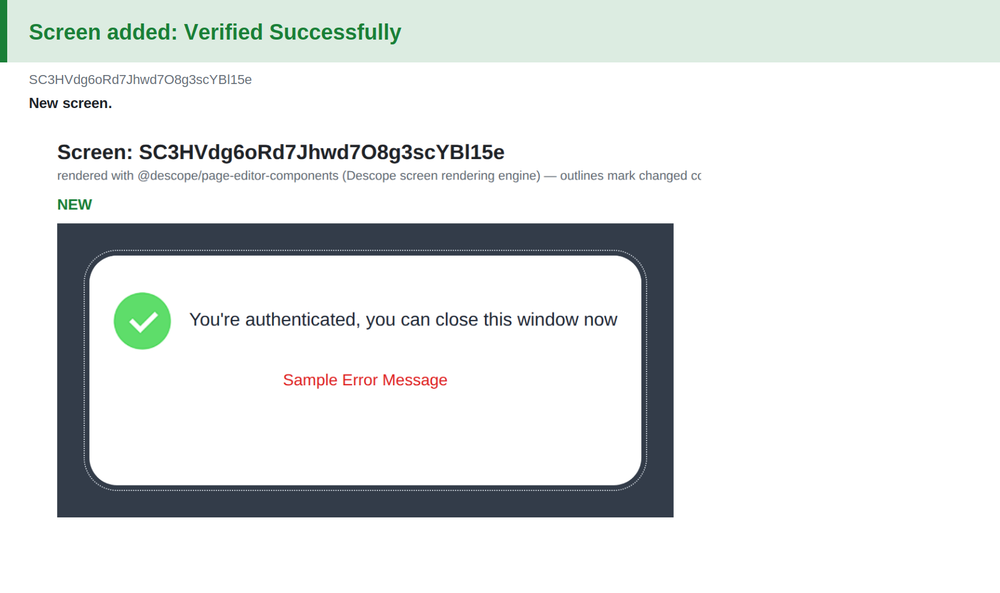
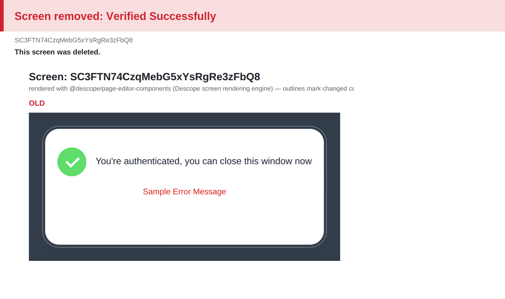

# Flow diff: `sign-up`

## Changes

- 🟢 **Added automated** `30` — Sign Up or In / Magic Link / Email
- 🟢 **Added screen** `31` — Magic Link Sent
- 🟢 **Added screen** `32` — Verified Successfully
- 🔴 **Removed screen** `15` — Verified Successfully
- 🔴 **Removed connector** `28` — Generic HTTP / GET
- 🟢 **New connection** Sign Up or In / Magic Link / Email ·success· → Magic Link Sent
- 🟢 **New connection** Magic Link Sent ·polling· → Verified Successfully
- 🟢 **New connection** Magic Link Sent ·resend· → Sign Up or In / Magic Link / Email
- 🔴 **Removed connection** Magic Link Sent ·polling· → Verified Successfully
- 🟡 **Error handling** Generic HTTP / GET · ConnectorFailed: automatic → —
- 🟡 **Error handling** Generic HTTP / GET · request_error: automatic → —

## Overview

## Changed regions

## Screen changes

