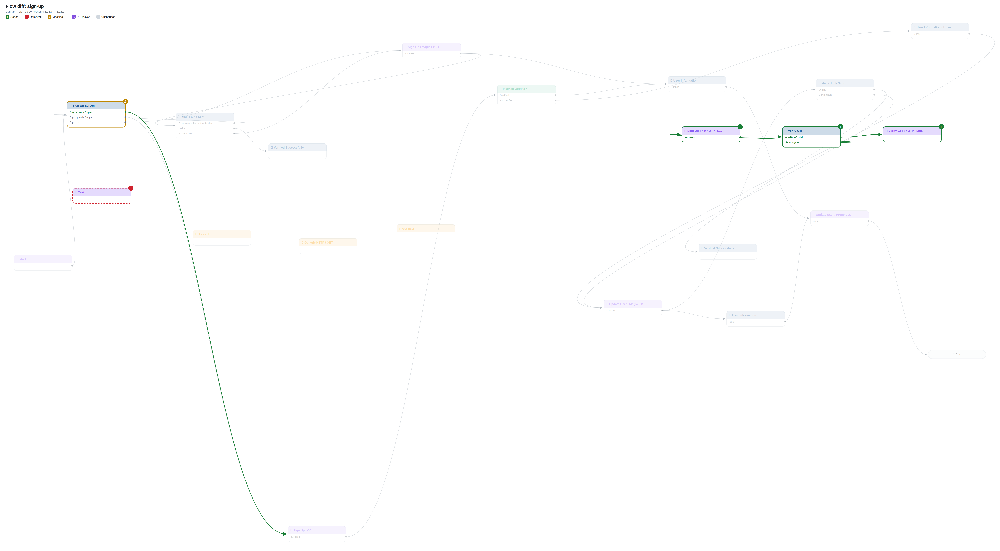
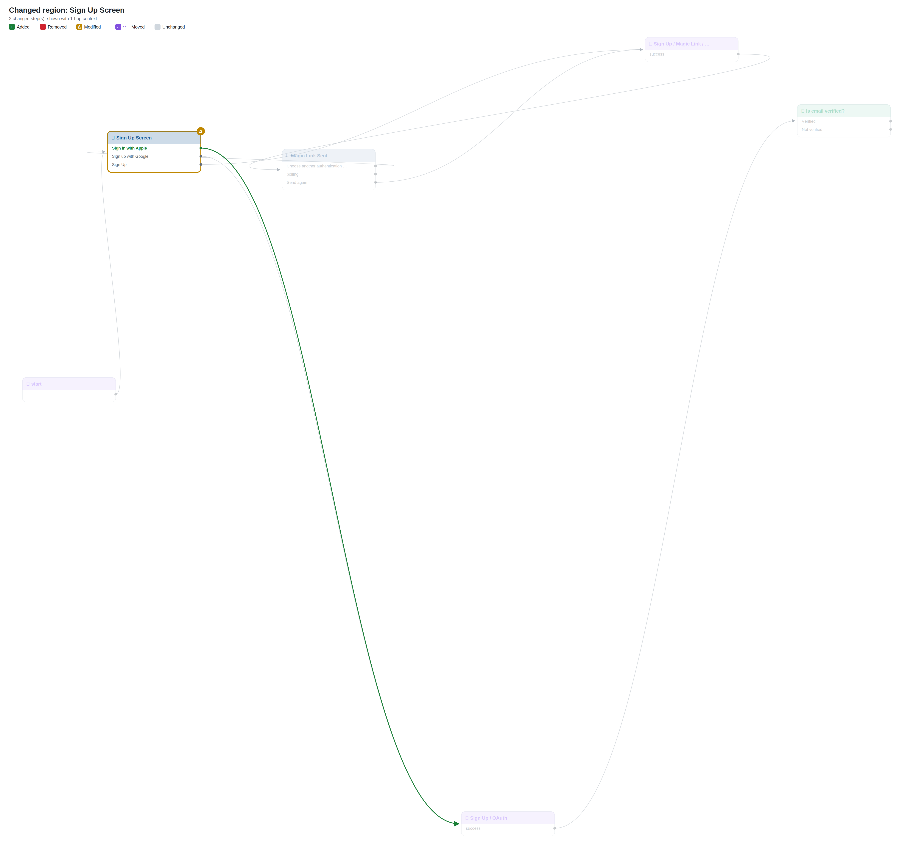
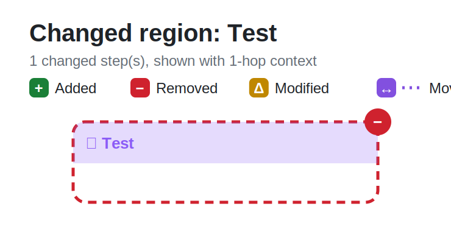
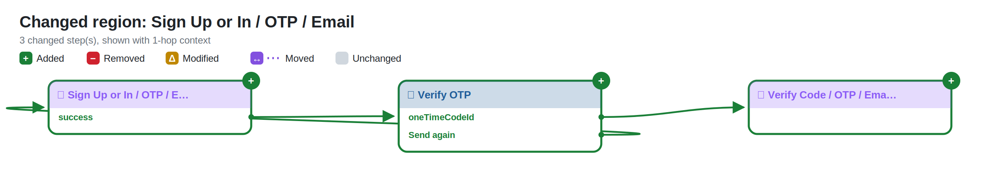
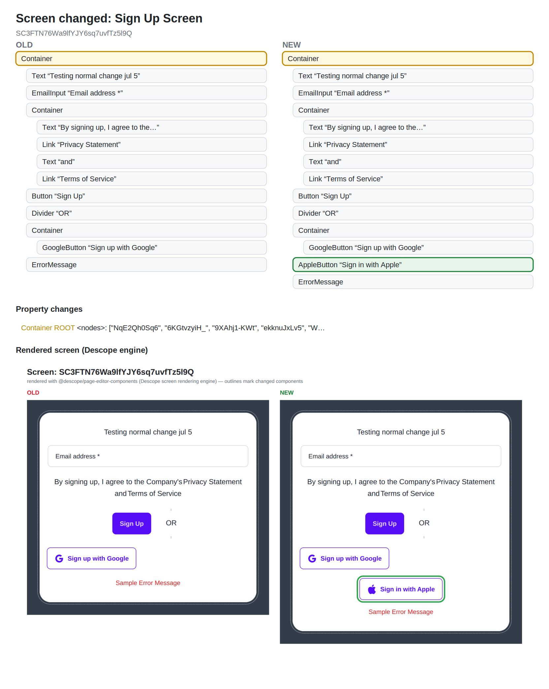
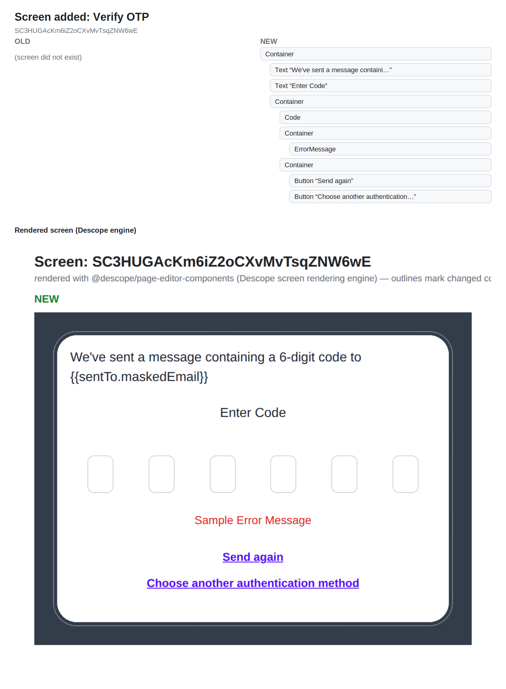

# Flow diff: `sign-up`

> Components version bump: **3.14.7 → 3.18.2** (0 default-prop changes suppressed as upgrade noise)

## Changes

- 🟢 **Added automated** `24` — Sign Up or In / OTP / Email
- 🟢 **Added screen** `25` — Verify OTP
- 🟢 **Added automated** `26` — Verify Code / OTP / Email
- 🔴 **Removed automated** `21` — Test
- 🟡 **Modified** `0` — Sign Up Screen (clientScripts, componentsConditions, componentsConnectors, connectorComponentProps, dynamicSelects, htmlTemplate, interactions, recoveryCodesData, screen)
- 🟢 **New connection** Sign Up Screen ·Gjob4tKKNP· → Sign Up / OAuth
- 🟢 **New connection** Sign Up or In / OTP / Email ·success· → Verify OTP
- 🟢 **New connection** Verify OTP ·oneTimeCodeId· → Verify Code / OTP / Email
- 🟢 **New connection** Verify OTP ·resend· → Sign Up or In / OTP / Email
- 🟡 **Error handling** Test · ScriptletFailed: automatic → —

## Overview

## Changed regions

## Screen changes

