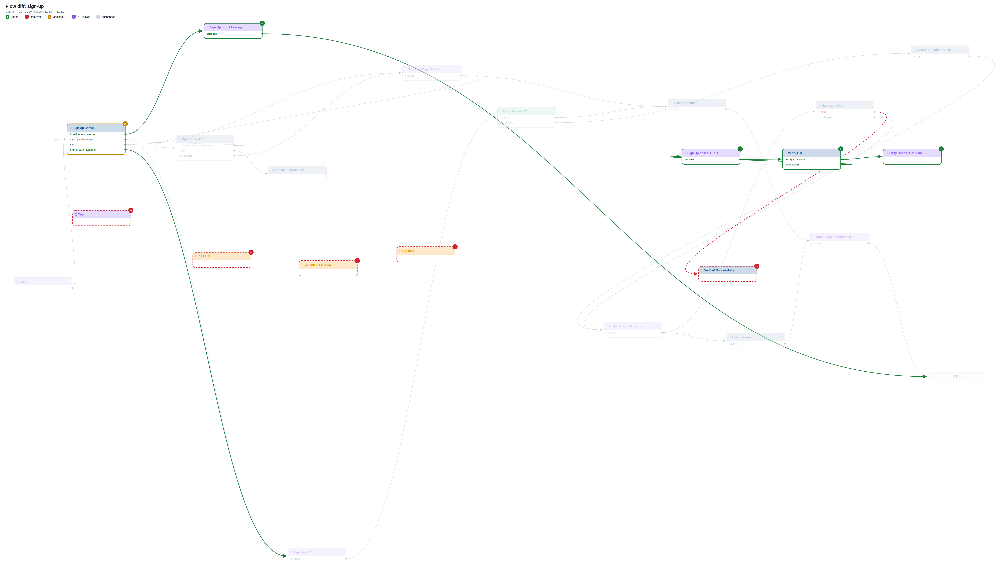
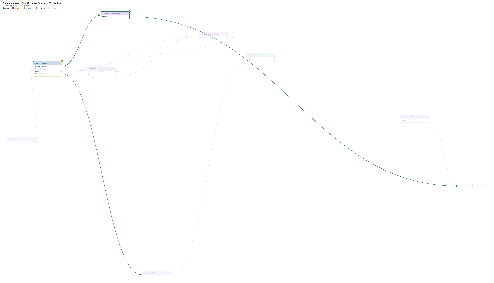
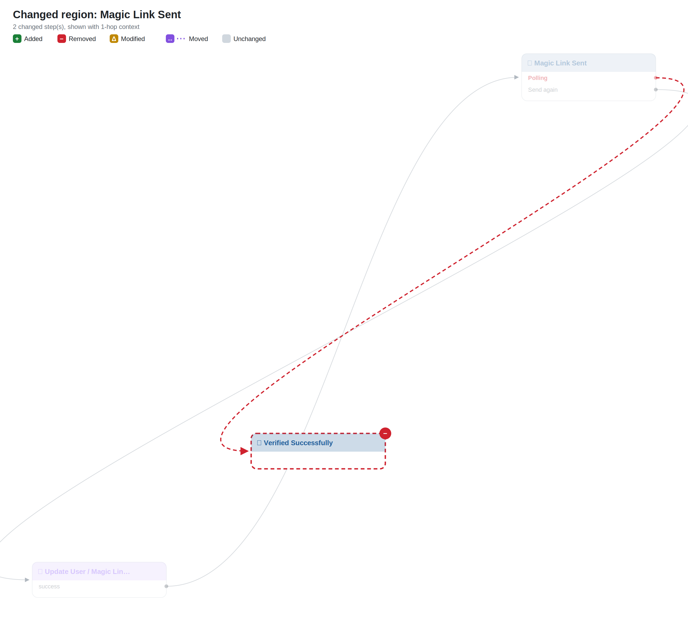
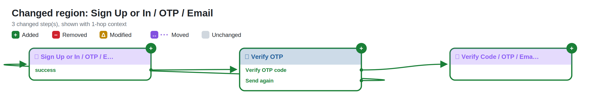
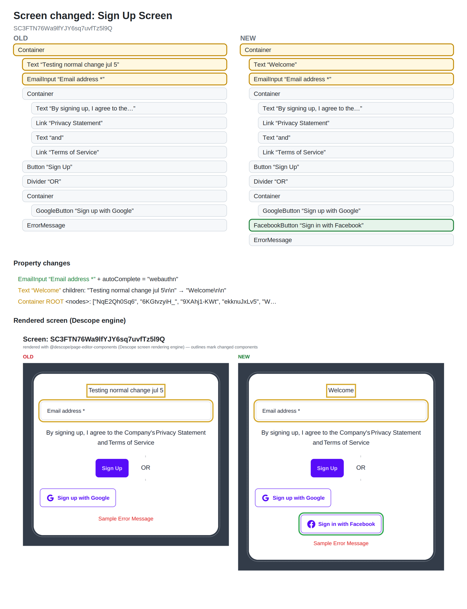
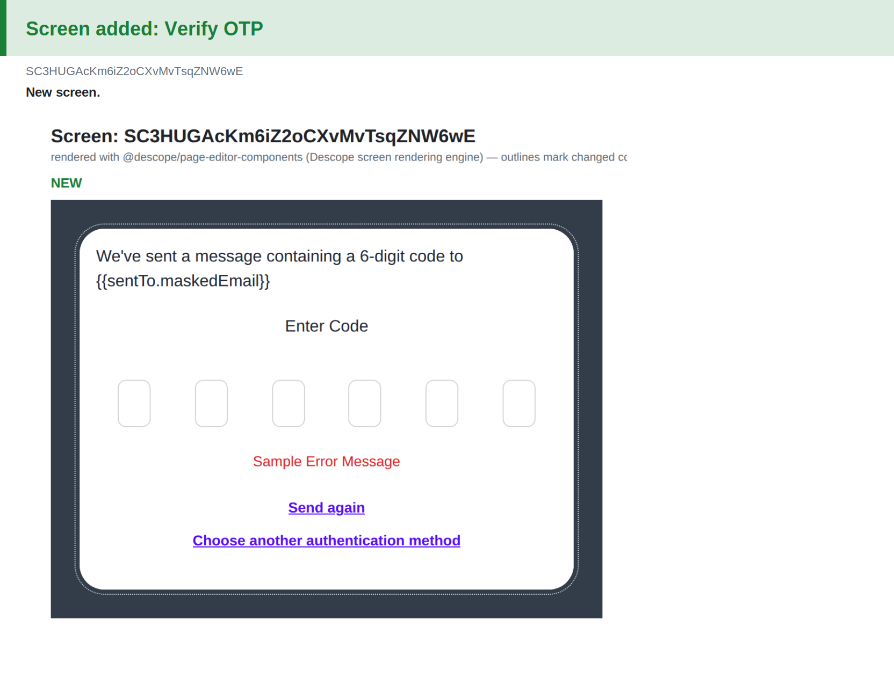
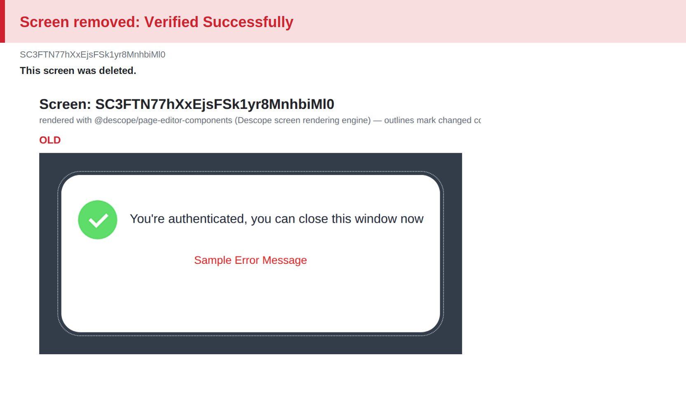

# Flow diff: `sign-up`

> Components version bump: **3.14.7 → 3.18.2** (0 default-prop changes suppressed as upgrade noise)

## Changes

- 🟢 **Added automated** `24` — Sign Up or In / OTP / Email
- 🟢 **Added screen** `25` — Verify OTP
- 🟢 **Added automated** `26` — Verify Code / OTP / Email
- 🟢 **Added automated** `27` — Sign Up or In / Passkeys (WebAuthn)
- 🔴 **Removed screen** `18` — Verified Successfully
- 🔴 **Removed connector** `20` — APPPLE
- 🔴 **Removed automated** `21` — Test
- 🔴 **Removed connector** `22` — Generic HTTP / GET
- 🔴 **Removed connector** `23` — Get user
- 🟡 **Modified** `0` — Sign Up Screen (htmlTemplate, interactions, screen)
- 🟢 **New connection** Sign Up Screen ·6KGtvzyiH_· → Sign Up or In / Passkeys (WebAuthn)
- 🟢 **New connection** Sign Up Screen ·keR6MsQTnS· → Sign Up / OAuth
- 🟢 **New connection** Sign Up or In / OTP / Email ·success· → Verify OTP
- 🟢 **New connection** Verify OTP ·oneTimeCodeId· → Verify Code / OTP / Email
- 🟢 **New connection** Verify OTP ·resend· → Sign Up or In / OTP / Email
- 🟢 **New connection** Sign Up or In / Passkeys (WebAuthn) ·success· → End
- 🔴 **Removed connection** Magic Link Sent ·polling· → Verified Successfully
- 🟡 **Error handling** APPPLE · ConnectorFailed: automatic → —
- 🟡 **Error handling** APPPLE · request_error: automatic → —
- 🟡 **Error handling** Test · ScriptletFailed: automatic → —
- 🟡 **Error handling** Generic HTTP / GET · ConnectorFailed: automatic → —
- 🟡 **Error handling** Generic HTTP / GET · request_error: automatic → —
- 🟡 **Error handling** Get user · ConnectorFailed: automatic → —
- 🟡 **Error handling** Get user · request_error: automatic → —

## Overview

## Changed regions

## Screen changes

