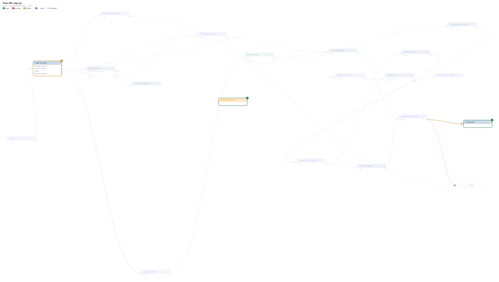
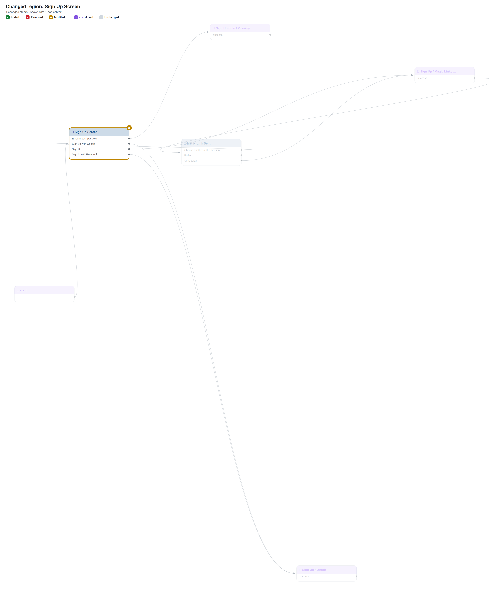
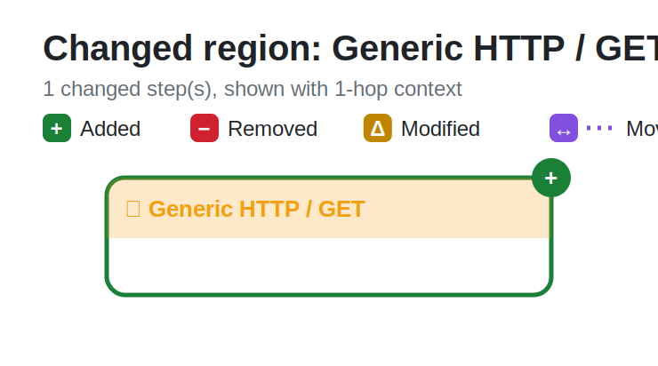
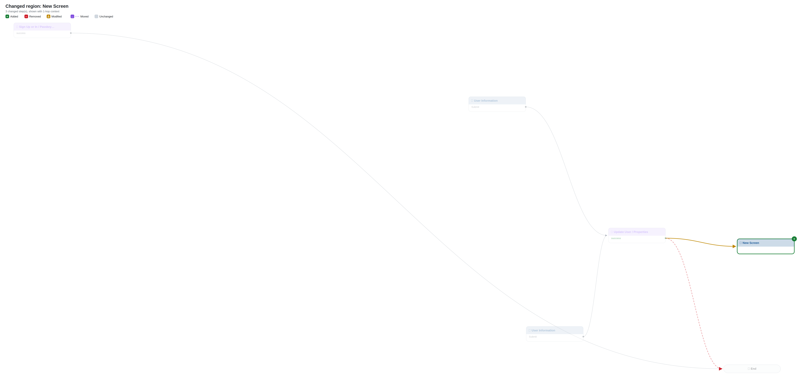
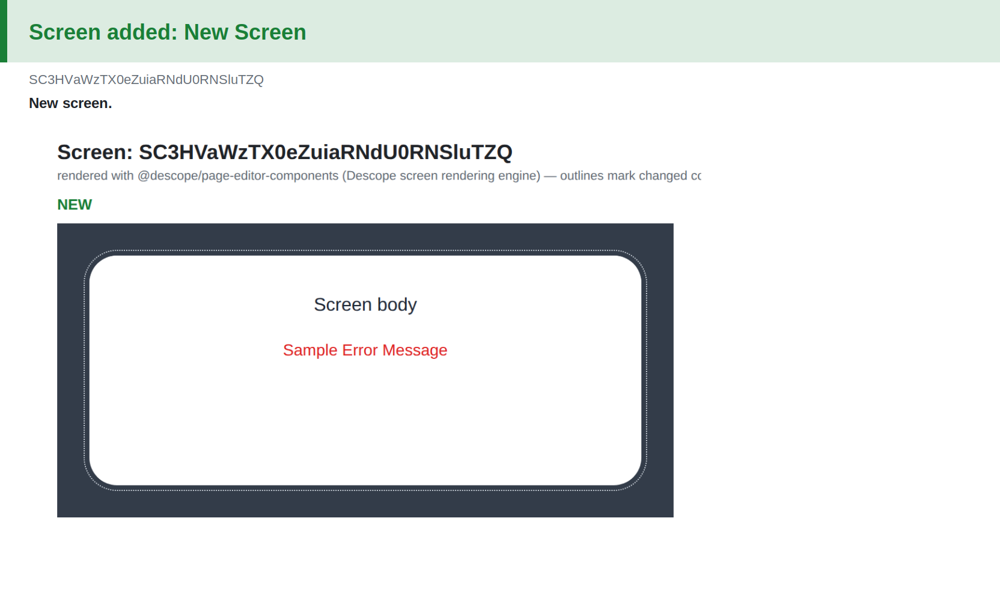

# Flow diff: `sign-up`

## Changes

- 🟢 **Added connector** `28` — Generic HTTP / GET
- 🟢 **Added screen** `29` — New Screen
- 🟡 **Modified** `0` — Sign Up Screen (clientScripts, componentsConditions, componentsConnectors, connectorComponentProps, dynamicSelects, htmlTemplate, interactions, recoveryCodesData)
- 🟡 **Rewired** Update User / Properties ·success· : End → **New Screen**
- 🟡 **Error handling** Generic HTTP / GET · ConnectorFailed: — → automatic
- 🟡 **Error handling** Generic HTTP / GET · request_error: — → automatic

## Overview

## Changed regions

## Screen changes

